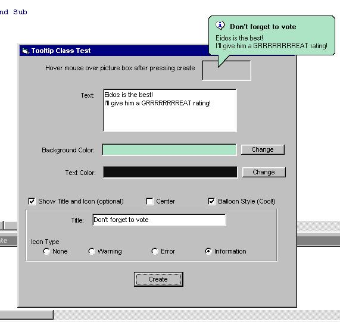



## Awesome Tooltips All API\!\!\!

### Description

This is a wrapper class for the comctl32 api, it allows you to create AWESOME tooltips --> they can be multiline, any background color, foreground color, balloon style, icons like only thought possible for windows ME, they look GOOD. to use balloon style requires IE5 +
 
### More Info
 

             |
---                |---
**Submitted On**   |2001-10-25 18:48:08
**By**             |[eidos](https://github.com/Planet-Source-Code/PSCIndex/blob/master/ByAuthor/eidos.md)
**Level**          |Intermediate
**User Rating**    |4.8 (302 globes from 63 users)
**Compatibility**  |VB 5\.0, VB 6\.0
**Category**       |[Windows API Call/ Explanation](https://github.com/Planet-Source-Code/PSCIndex/blob/master/ByCategory/windows-api-call-explanation__1-39.md)
**World**          |[Visual Basic](https://github.com/Planet-Source-Code/PSCIndex/blob/master/ByWorld/visual-basic.md)
**Archive File**   |[Awesome To3117410252001\.zip](https://github.com/Planet-Source-Code/eidos-awesome-tooltips-all-api__1-28419/archive/master.zip)

### API Declarations

see code

